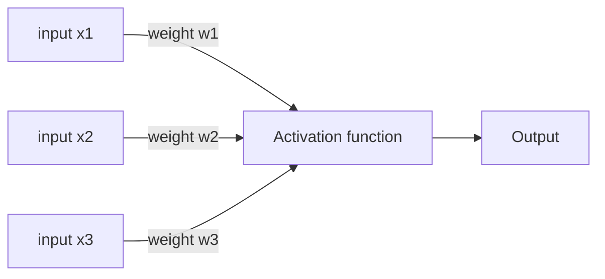

# 1. Activation function table
> There are many different types of the Activation functions that use in machine learning.
>
> Each neural network is used to update weights by calculating prediction errors in the Artificial Intelligence learning phase.

The details are well organized [here](https://ko.wikipedia.org/wiki/%EC%9D%B8%EA%B3%B5_%EC%8B%A0%EA%B2%BD%EB%A7%9D)

| __Number__ | [__Activation function__](#description-to-activation-function) | __Equation & Module__ | __Case__ | __One-dimensional graph__ |
|:---:|:---:|:---:|:---:|:---:|
| 1 | [Linear function](#1-linear-function) | $\phi(z) = z$ | Adalin, Linear Regression |  |
| 2 | [Heaviside function](#2-heaviside-function) |  | Perceptron type |  |
| 3 | [Sign(um) function](#3-sign-function) |  | Perceptron type |  |
| 4 | [Partial Linear funtion](#4-partial-linear-function) |  | Support vector machine |  |
| 5 | [Simoid (logistic) function](#5-sigmoid-function) |  | Logistic Regression, Multi-Layer Perceptron(MLP) |  |
| 6 | [Hyperbolic tangent (tanh) function](#6-hyperbolic-tangent-function) |  | Multi-Layer Perceptron(MLP) |  |
| 7 | [Softmax function](#7-softmax-function) |  | Multi-class classification, Multi-Layer Perceptron(MLP), Multinomial Logistic Regression |  |
| 8 | [ReLU function (Rectified Linear Unit)](#8-relu-function) |  | Multi-Layer Perceptron(MLP), CNN(Convolutional Neural Networks) |  |
| 9 | [Leaky ReLU function](#9-leaky-relu-function) |  | Multi-Layer Perceptron(MLP), CNN(Convolutional Neural Networks) |  |
| 10 | [Exponential Linear Unit (ELU)](#10-elu-function) |  | Multi-Layer Perceptron(MLP), CNN(Convolutional Neural Networks) |  |

<!--
using LaTex grammar

$$\phi(z) = \begin{cases}-1 & \quad (z \leq -\frac{1}{2})\\\z + \frac{1}{2} & (-\frac{1}{2} \leq z \leq \frac{1}{2})\\\1 & \quad \\; (z \geq \frac{1}{2})\\ \end{cases}$$

$$\phi(z) = \frac{\mathrm{e}^{z} - \mathrm{e}^{-z}}{\mathrm{e}^{z} + \mathrm{e}^{-z}\}$$

$$ \phi(x_i) = \frac{e^{x_i}}{\displaystyle\sum_{j=1}^{n}{e^{x_j}}} $$

$$\phi(z) = \begin{cases}\alpha z\\; (0 < \alpha < 0.01) & (z < 0)\\\ z & (z > 0)\\ \end{cases}$$
-->

___
# 2. Description to Activation Function
> [Refer to the table above](#1-activation-function-table)
#### Consideration about the activation functions used in Neural Network Model how they are worked way and applied case.
The activation function is divided into three parts.

* Binary step activation function
  * Heaviside function
  * Sign(um) function
* Linear activation function
  * Linear function
  * Partial linear function
* Non-linear activation function
  * Sigmoid function
  * Hyperbolic tangent function
  * softmax function
  * ReLU function
  * ELU function
  * etc.

It mimics a human nerve cell called 'Neuron'. The neuron outputs the intensity of the signal, not the presence or absence of transmission of the signal. It is activated depending on whether the input of each neuron is related to the prediction of the model. Here, the method of determined to the intensity of signal is the 'activation function'.

___

### (1) Linear function

  * Inheritance module to need : [`tensorflow.keras.activations.linear`](https://www.tensorflow.org/api_docs/python/tf/keras/activations/linear)

  * Feature : The linear function outputs an input value multiplied by some integer.

  * Advantage : Multiple outputs are possible. That's all. it just linearly changed. so, it won't learned deeply.
  
  * Disadvantage : Backpropagation is not available. No matter how deep to the neural layer, there is no change. There is no advantage by using multiple layers. (Learning is a better change.)

### (2) Heaviside function

  * Inheritance module to need : [`from skleran.learn_model import Perceptron`](https://scikit-learn.org/stable/modules/generated/sklearn.linear_model.Perceptron.html)

  * Feature : It is used to linearly distinguish a data set. If the input value exceeds the boundary value, 1 is output, and if not, 0 is output.

  * Advantage : It is the most basic activation function.

  * Disadvantage : It is not suitable for use as an activation function because it is an undifferentiable function. So, it is impossible to machine learning. And very different from biological neurons

### (3) Sign function

  * Inheritance module to need : [`tensorflow.math.sign`](https://www.tensorflow.org/api_docs/python/tf/math/sign)

  * Feature : It is used to linearly distinguish a data set. If the input value exceeds the boundary value, 1 is output, and if not, -1 is output.

  * Advantage : Learning speed is fast better than the Heaviside function because some output is -1 not 0. It is undifferentiable function.

  * Disadvantage : It is possible to simple machine learning, but it is impossible about from complex problem. So, it is impossible backpropagation.

### (4) Partial linear function

  * Inheritance module to need : [`tensorflow.function`](https://www.tensorflow.org/api_docs/python/tf/function) (The details of the function must be defined directly.)

  * Feature : A function complemented to enable backpropagation. It complements function in order to enable backpropagation. It is also used to improve and restore video image quality.

  * Advantage : The probability of buffer flooding has been reduced. It possible to backpropagation. 

  * Disadvantage : It is inefficient about small input values. Learning complexity is simple than a non-linear activation function. therefore, it unfits to solve a complex problem.

### (5) Sigmoid function

  * Inheritance module to need : [`tensorflow.keras.activations.sigmoid`](https://www.tensorflow.org/api_docs/python/tf/keras/activations/sigmoid)

  * Feature : Output value is among 0 and 1. It is used to the Binary classification problem often. Its maximum value in differential function is 1/4 at x = 0. If it increases above a certain value, it converges to zero. So, it can be caused problem in Backpropagation step.

  * Advantage : By using this function, we can benefit from the multi-layer perceptron problem.

  * Disdvantage : The output value is always positive. So, its learning speed is too slow. And there is problem that occurs to decrease the output value in backpropagation step. (the slow learning speed is called 'Vanishing gradient' problem.)

### (6) Hyperbolic tangent function

  * Inheritance module to need : [`tensorflow.keras.activations.tanh`](https://www.tensorflow.org/api_docs/python/tf/keras/activations/tanh)

  * Feature : A function with complementary functions of sigmoid. Unlike the sigmoid, this value is negative and the median is 0. Compared to sigmoid, the maximum value of the differential function is four times larger.

  * Advantage : It solved 'non-zero centered problem' a disadvantage of sigmoid. In addition, there is no biased movement because the median value is 0. And learning efficiency is better than Sigmoid. It solves the vanishing gradient problem in sigmoid function.

  * Disadvantage : The vanishing gradient problem has not been completely solved(The chronic problem of the activation functions).

### (7) Softmax function

  * Inheritance module to need : [`tensorflow.keras.activations.softmax`](https://www.tensorflow.org/api_docs/python/tf/keras/activations/softmax)

  * Feature : It outputs a value between 0 and 1. It is used for 'Multi-classification Problem' and 'Multi-Logistic Regression'. If it adds all of the output of the node, you get 1. All input values are changed to exponential values in order to normalize each element.

  * Advantage : There is an effect of making the weight larger because all input values are changed to exponential values. It can classify more classes.

  * Disadvantage : It occurs **overflow problem** due to exponential operations.

### (8) ReLU function

  * Inheritance module to need : 

  * Feature : 

  * Advantage : 

  * Disadvantage : 

### (9) Leaky ReLU function

  * Inheritance module to need : 

  * Feature : 

  * Advantage : 

  * Disadvantage : 

### (10) ELU function

  * Inheritance module to need : 

  * Feature : 

  * Advantage : 

  * Disadvantage : 

---

# Index
1. [Activation function table](#1-activation-function-table)
2. [Description to Activation Function](#2-description-to-activation-function)
    * (1) [Linear function](#1-linear-function)
    * (2) [Heaviside function](#2-heaviside-function)
    * (3) [Sign(um) function](#3-sign-function)
    * (4) [Partial Linear funtion](#4-partial-linear-function)
    * (5) [Simoid (logistic) function](#5-sigmoid-function)
    * (6) [Hyperbolic tangent (tanh) function](#6-hyperbolic-tangent-function)
    * (7) [Softmax function](#7-softmax-function)
    * (8) [ReLU function (Rectified Linear Unit)](#8-relu-function)
    * (9) [Leaky ReLU function](#9-leaky-relu-function)
    * (10) [Exponential Linear Unit (ELU)](#10-elu-function)
